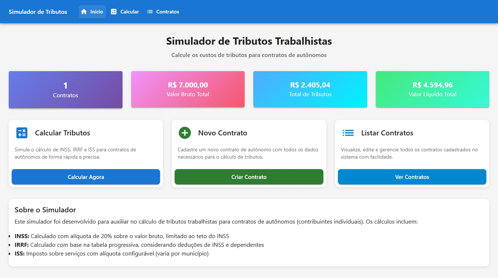
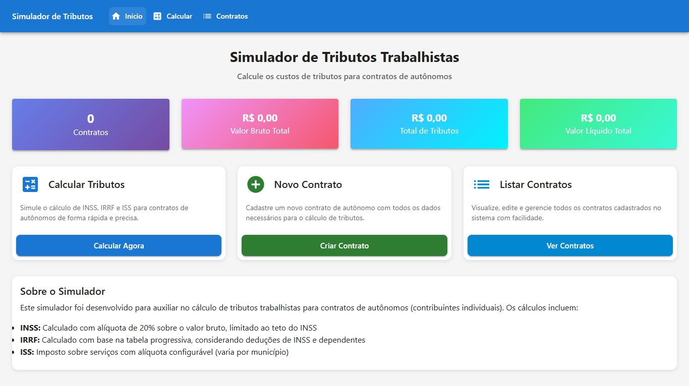
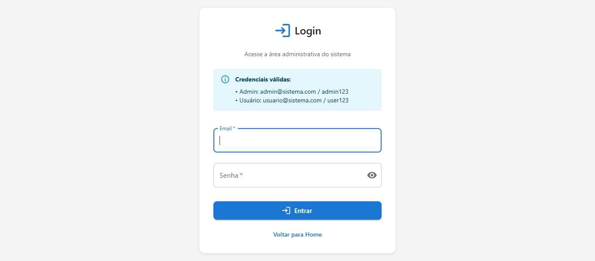
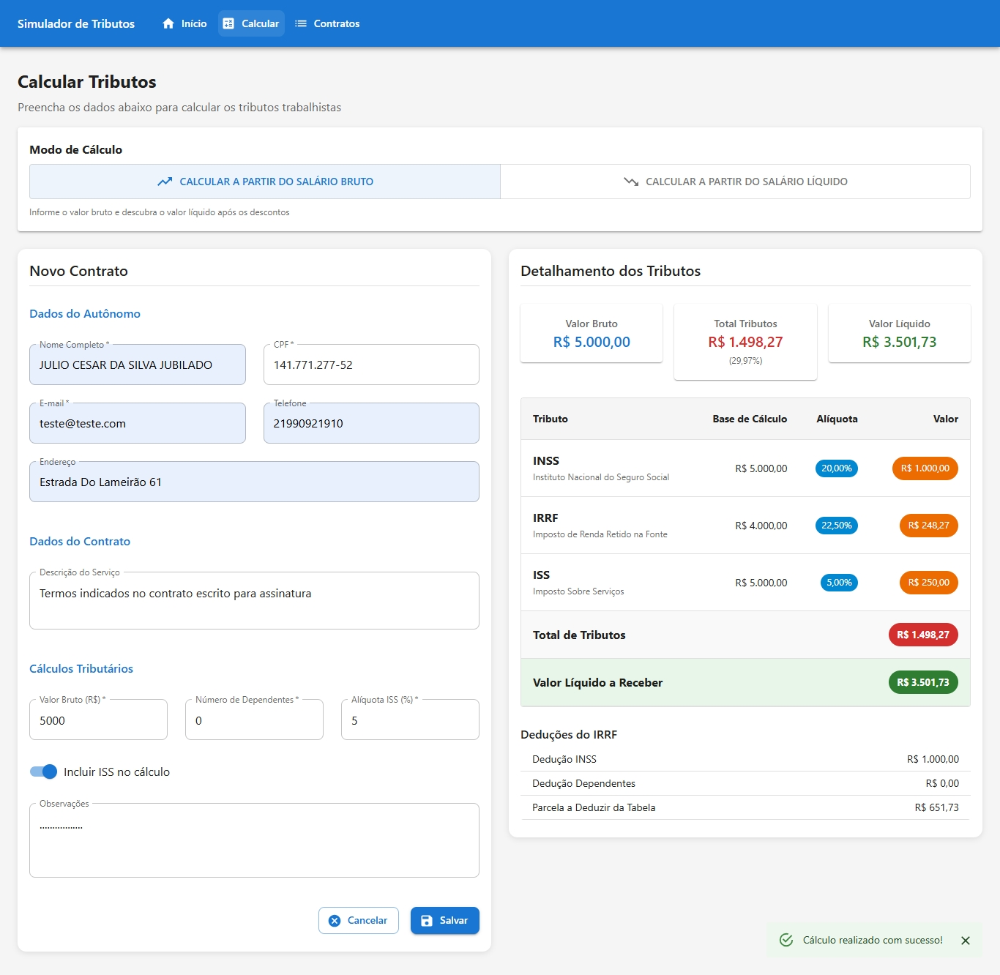
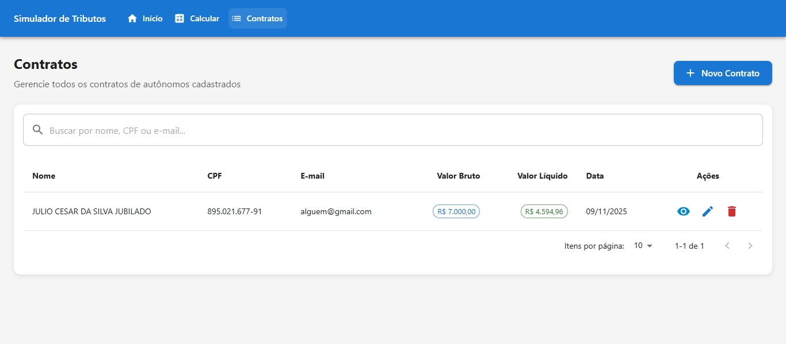
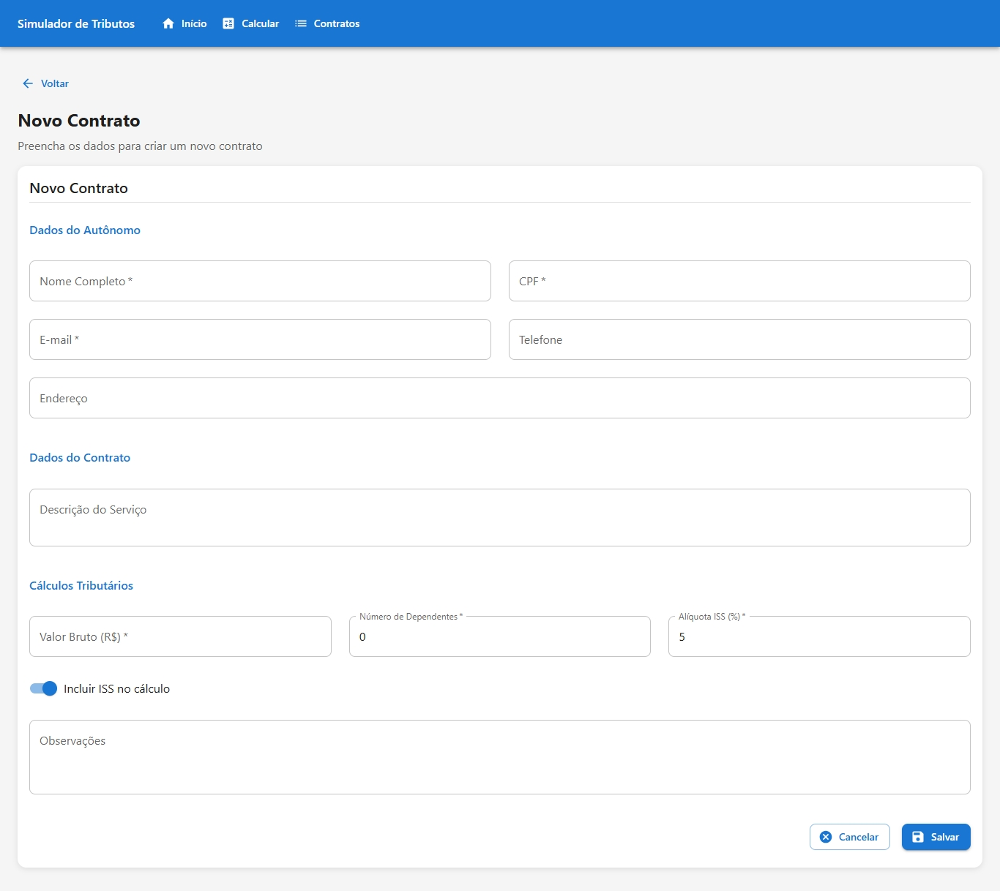
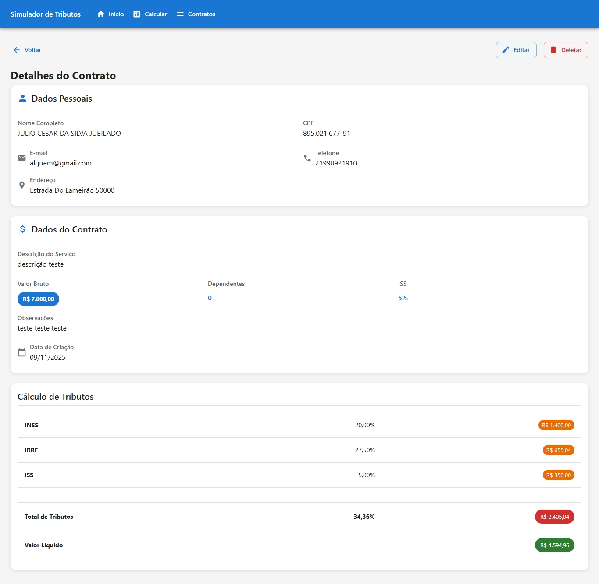
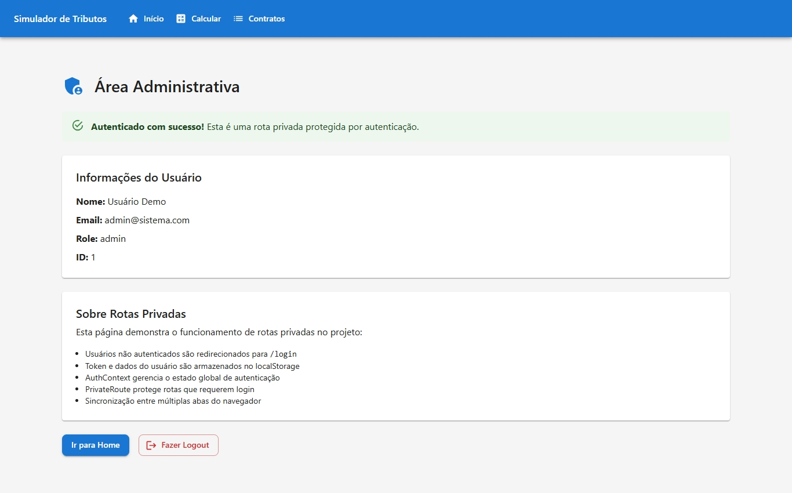

# Simulador de Cálculo de Custos de Tributos Trabalhistas

Aplicação web para simulação de cálculos de tributos trabalhistas em contratos de autônomos.

## Quick start

1. Clone o repositório:

```powershell
git clone https://github.com/booletech/Simulador_tributos_trab.git
cd Simulador_tributos_trab
```

2. Instale dependências:

```powershell
npm install
```

3. Execute em modo de desenvolvimento:

```powershell
npm run dev
```

Abra http://localhost:3000 no navegador.

4. **Credenciais de acesso:**

Para acessar áreas protegidas (ex: `/admin`):
- **Admin:** admin@sistema.com / admin123
- **Usuário:** usuario@sistema.com / user123

Ver `AUTENTICACAO.md` para mais detalhes sobre autenticação.

Se necessário, crie `.env.local` com `VITE_API_URL` para integrar com backend.

## 📸 Screenshots

### Tela Inicial (Dashboard)


### Tela Inicial Vazia


### Página de Login


### Resultado do Cálculo


### Lista de Contratos


### Novo Contrato


### Detalhes do Contrato


### Área Administrativa (Rota Privada)


## Useful commands

```powershell
npm run dev       # start dev server
npm run build     # production build
npm run preview   # preview production build
npm run lint      # run linter
```

## What is included

- **Authentication system:** Login with fixed credentials, protected private routes
- Tax calculators: INSS, IRRF, ISS (business rules in `src/utils/tributosCalculos.js`)
- CRUD for contracts (persisted to `localStorage`)
- React Context state in `src/context/TributosContext.jsx` and `src/context/AuthContext.jsx`
- Custom hooks: `useForm`, `useDebounce`, `useTributos`, `useAuth`
- Material-UI-based theme in `src/theme.js`

## Where to look next

- `AUTENTICACAO.md` — authentication guide with credentials and configuration
- `PERFORMANCE.md` — consolidated performance & optimization guide
- `CONTRIBUTING.md` — development and contribution guidelines
- `GUIA_RAPIDO.md` — short user-facing quick guide (how to use the app)
- `docs/COMPLIANCE_REPORT.md` — 100% compliance report with academic requirements
- `PERFORMANCE.md` and `CONTRIBUTING.md` were added to reduce duplication; full academic artifacts are in the `docs/` folder.

## Project structure (short)

```
src/
├── components/
├── pages/
├── context/
├── hooks/
├── services/
├── utils/
└── data/
```

## Important notes

- The app currently runs with local mock data (localStorage). To use an API, set `VITE_API_URL`.
- Calculations are memoized & cached (LRU cache) in `src/utils/tributosCalculos.js`.

---

For detailed documentation and academic reports see the `docs/` folder and the other guides (`PERFORMANCE.md`, `CONTRIBUTING.md`, `GUIA_RAPIDO.md`).

---

**Última atualização:** November 9, 2025
